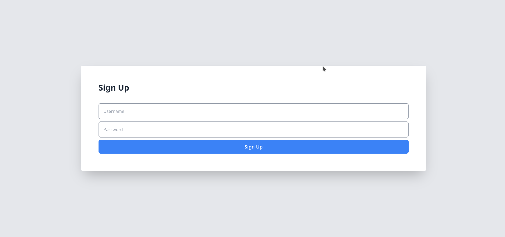
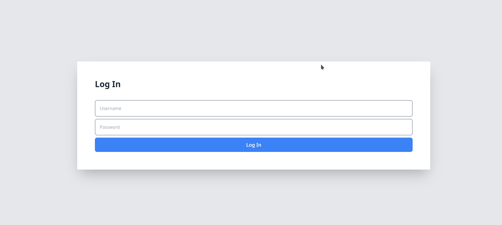
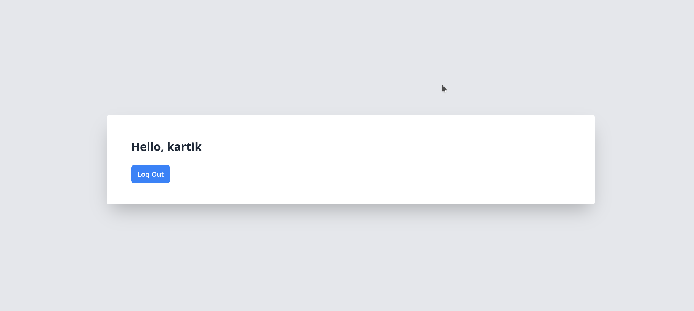

# PHP User Authentication System

## Introduction

This project is a PHP-based user authentication system that includes user registration, login, and logout functionalities. The application is developed using PHP for backend processing, HTML for frontend display, and Tailwind CSS for styling. It provides a simple yet effective way of managing user sessions and access control.

## Tech Stack

- **PHP:** Server-side scripting language used for backend logic and session management.
- **HTML:** Markup language for structuring and presenting content on the web.
- **Tailwind CSS:** A utility-first CSS framework for rapidly building custom designs.
- **MySQL:** Database system used for storing user credentials and session information.

## Pages and Functionalities

### 1. Sign Up Page (`sign.php`)

- **Functionality:** Allows new users to create an account.
- **Process:** 
  - User provides a username and password.
  - The system checks if the username already exists in the database.
  - If the username is unique, the user's data is stored in the database.

### 2. Log In Page (`login.php`)

- **Functionality:** Enables registered users to log in.
- **Process:** 
  - User enters their username and password.
  - The system validates these credentials against the database.
  - If the credentials are correct, the user is redirected to the dashboard/home page.

### 3. Home Page (`home.php`)

- **Functionality:** The main dashboard for logged-in users.
- **Access Control:** 
  - The page is accessible only if the user is logged in.
  - If not logged in, the user is redirected to the login page.

### 4. Logout (`logout.php`)

- **Functionality:** Allows users to log out.
- **Process:** 
  - Destroys the current session.
  - Redirects the user back to the login page.

## Database Connection (`connect.php`)

- Establishes a connection with the MySQL database.
- Contains credentials for the database connection.

## Security Considerations

- The current implementation uses plain text for password storage, which is not secure. It is recommended to implement password hashing for better security.
- Proper validation and sanitization of user input are essential to prevent SQL injection and other security vulnerabilities.

## Conclusion

This PHP user authentication system demonstrates basic functionalities required for managing user sessions in a web application. It's a starting point and can be expanded with additional features like password hashing, email verification, and more sophisticated session management for enhanced security and user experience.
